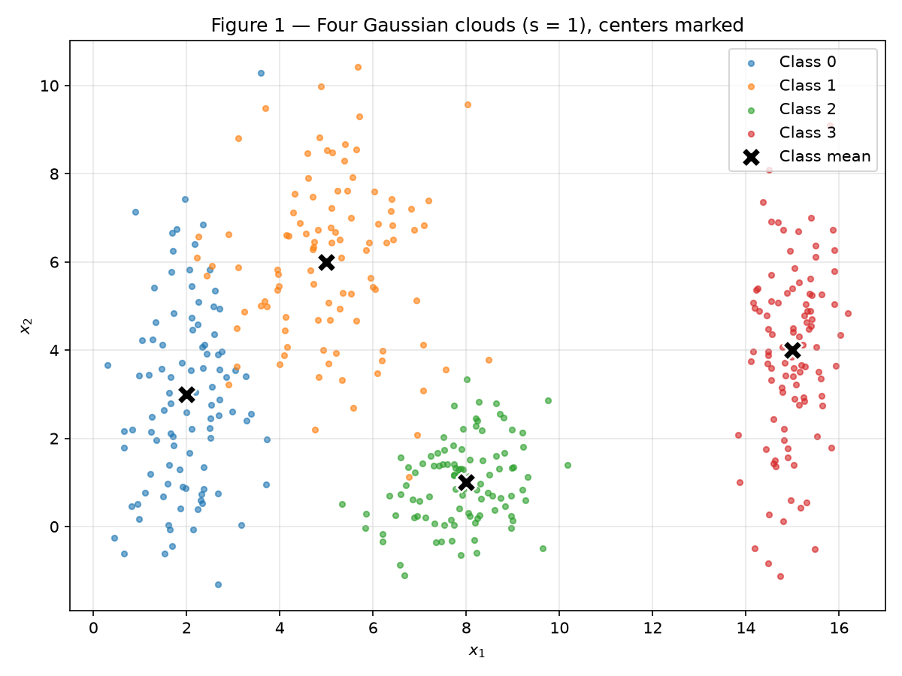
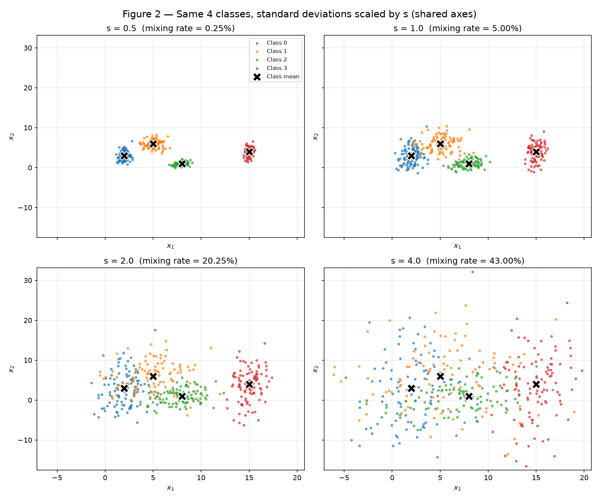
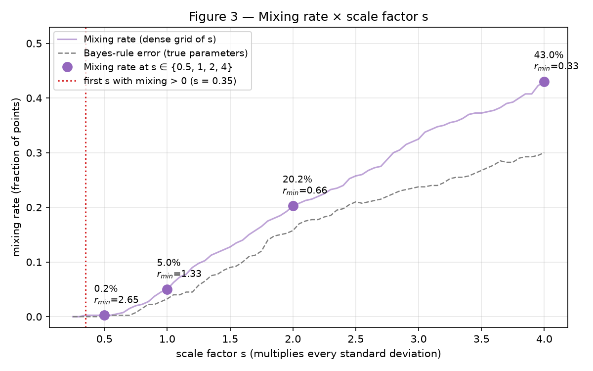
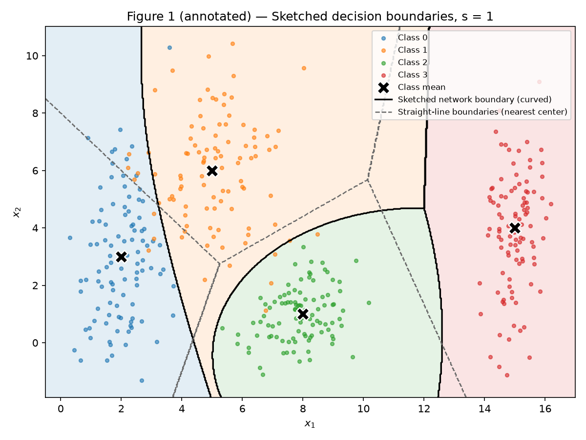
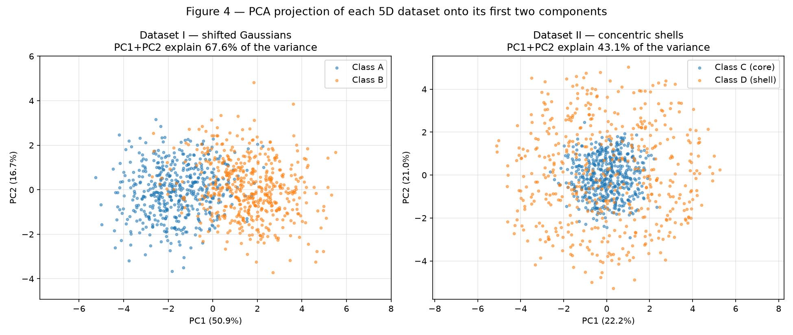
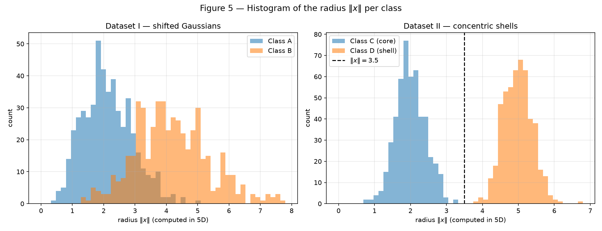
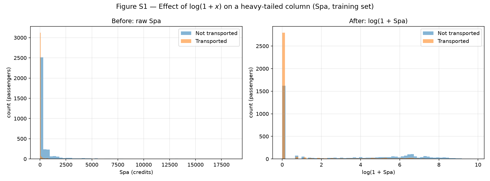
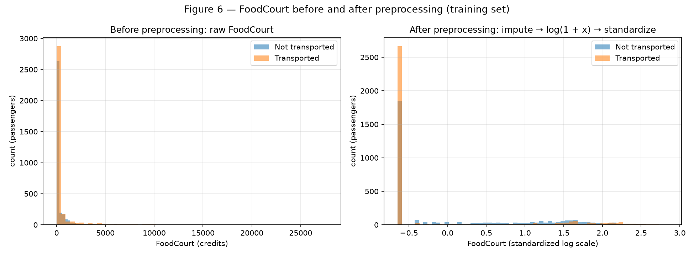

# 1. Data

**Approach in one paragraph.** Everything is generated by one script,
`code/main.py`, which creates a single generator `rng = np.random.default_rng(42)`
and passes it, in order, to the three exercise modules (`ex1_point_clouds.py`,
`ex2_nonlinearity.py`, `ex3_spaceship_titanic.py`). Each module saves its figures
to `figures/`, its tables to `tables/` (included below), and its numbers to
`results.json`. Re-running `python docs/exercises/data/code/main.py` from the
repository root reproduces every value in this report. No model is trained
anywhere: only NumPy/pandas, Matplotlib, and scikit-learn's `PCA` and
preprocessing tools (`SimpleImputer`, `OneHotEncoder`, `StandardScaler`).

??? example "Entry point — `code/main.py`"

    ``` python
    --8<-- "docs/exercises/data/code/main.py"
    ```

---

## Exercise 1

??? example "Code — `code/ex1_point_clouds.py`"

    ``` python
    --8<-- "docs/exercises/data/code/ex1_point_clouds.py"
    ```

### A — Generate the clouds

I draw a standard-normal noise tensor `z` of shape `(4, 100, 2)` once and build
each class as \(x = \mu_k + s\,\sigma_k \odot z\). For \(s = 1\) this is exactly
\(\mathcal{N}(\mu_k, \mathrm{diag}(\sigma_k^2))\) with the parameters of the statement,
giving **400 samples, 100 per class**. The sample statistics match the targets
(e.g. class 0: mean \((1.99, 2.89)\), std \((0.73, 2.14)\); class 3: mean
\((14.99, 3.88)\), std \((0.52, 2.02)\)).


/// caption
Figure 1 — The four Gaussian clouds (\(s = 1\)); black crosses mark each class mean.
///

### B — More or less spread out

The same noise `z` is reused for every scale factor, so the four datasets
(\(s \in \{0.5, 1, 2, 4\}\), each with the same 4 classes) differ **only** in their
spread — the means and the "random luck" are identical, which makes the
comparison honest. Figure 2 uses shared axis limits.


/// caption
Figure 2 — The same 4 classes with every standard deviation multiplied by \(s\) (shared axes).
///

**Separation ratio at \(s = 1\).**

--8<-- "docs/exercises/data/tables/ex1_separation.md"

The **smallest ratio is \(r_{01} = 1.326\), between classes 0 and 1** (centers
only \(4.24\) apart while their average spreads add up to \(3.20\)). Since the
means are fixed and every \(\bar\sigma\) is multiplied by \(s\), \(r_{ij}\) scales
with \(1/s\): at \(s = 2\) the smallest ratio becomes
\(1.326 / 2 = \mathbf{0.663}\), i.e. the centers are closer than the sum of the
average spreads.

**Mixing rate.** For each point I compute its distance to the 4 means and check
whether the closest one is its own class (`nearest_center` / `mixing_rate`).

--8<-- "docs/exercises/data/tables/ex1_mixing.md"

Mixing rates: **0.25 % at \(s = 0.5\)** (1 of 400 points), **5.00 % at \(s = 1\)**
(20 points), **20.25 % at \(s = 2\)** (81 points) and **43.00 % at \(s = 4\)**
(172 points). At \(s = 1\) the mixed points are all between neighbouring classes:
8 points of class 0 closer to center 1, 6 points of class 1 closer to center 0
and 6 points of class 1 closer to center 2; classes 2 and 3 have no point
assigned elsewhere.

For context, the table also reports the *Bayes-rule error*: the error of the
best possible rule, which assigns each point to the class with the highest
density under the **true** parameters (nothing is fitted). It is a floor that
no classifier can beat.


/// caption
Figure 3 — Mixing rate × scale factor \(s\). The large markers are the four required datasets; the thin line repeats the measure on a dense grid of \(s\) (same noise) and the dashed line is the Bayes-rule error.
///

**From which \(s\) on can the clouds no longer be separated by straight lines?**
From **\(s = 1\)** on. At \(s = 0.5\) only one point (0.25 %) is mixed — a tail
point of the elongated class 0 (\(\sigma_y = 2.5\)) that the nearest-center rule,
which ignores that elongation, gets wrong — and the Bayes-rule error is
**0 %**, so a set of well-placed boundaries still separates every class. At
\(s = 1\) the mixing jumps to **5 %** and even the Bayes rule errs on **3.25 %**
of the points: clouds 0 and 1 (and the edge of 1 with 2) truly overlap, so no
set of straight lines can separate them without mistakes; at \(s = 2\) and
\(s = 4\) the overlap only grows (20.25 % and 43 %).

**What happens to the smallest \(r_{ij}\)?** It falls from **2.65** at
\(s = 0.5\) to **1.33** at \(s = 1\) — below 2, meaning the two clouds' "one
average standard deviation" regions around the centers are closer than two
spreads apart, so their tails meet. At \(s = 2\) it drops to **0.66 < 1**: the
centers are closer than the sum of the spreads, and the mixing rate reaches 20 %.
The first grid value with any mixing, \(s = 0.35\) (\(r_{min} = 3.79\)), is the
same single tail point of class 0 and is not a real overlap (Bayes error 0).

### C — Analysis

**Overlap at \(s = 1\).** Class 3 is isolated on the right (\(r \geq 3.54\)
against every other class); class 2 is compact (\(\sigma = 0.9\)) and well apart
(\(r_{02} = 2.48\), \(r_{12} = 2.38\)), with only a few class-1 points reaching
it. The real overlap is between **classes 0 and 1** (\(r_{01} = 1.33\)): class 0
is tall and thin (\(\sigma_y = 2.5\)) and its upper part enters the lower-left
part of class 1.

**One linear boundary?** No. A single line splits the plane into only two
half-planes, so it can at most separate one group of classes from another —
never four classes.

**A set of linear boundaries?** Almost. Three boundaries (e.g. the dashed
nearest-center lines in the figure below, or one line per class vs. the rest)
isolate class 3 and class 2 with essentially no errors, but between classes 0
and 1 the clouds overlap, so any line leaves some points on the wrong side
(5 % mixing for the nearest-center lines).


/// caption
Figure 1 (annotated) — Sketch of the decision boundaries a trained network might learn (solid, curved) versus the straight nearest-center boundaries (dashed), \(s = 1\).
///

**Sketch.** The solid curves in the annotated Figure 1 are the boundaries a
trained network would tend to approximate: they are the most-likely-class
boundaries under the true Gaussians, drawn from the known parameters (nothing
is trained). They are curved because the classes have different shapes: a
bent boundary between 0 and 1 that follows the tall shape of class 0, a closed
arc around the compact class 2, and an almost vertical wall around
\(x_1 \approx 12.3\) in front of class 3. A network with a few `tanh` hidden units
builds such curves by combining several soft linear pieces.

**Relation with item B.** Near the 0/1 frontier the densities of two classes
are comparable, and in that region the network **necessarily** makes mistakes —
whatever boundary it learns. As the clouds spread, that region grows: the
Bayes-rule error goes **0 % → 3.25 % → 15.75 % → 30 %** for
\(s = 0.5, 1, 2, 4\) (and the mixing rate 0.25 % → 5 % → 20.25 % → 43 %). More
spread means a larger irreducible error, not something a bigger network can
fix.

---

## Exercise 2

??? example "Code — `code/ex2_nonlinearity.py`"

    ``` python
    --8<-- "docs/exercises/data/code/ex2_nonlinearity.py"
    ```

### A — Dataset I: shifted Gaussians

500 samples per class drawn with `rng.multivariate_normal` using exactly
\(\mu_A, \Sigma_A\) and \(\mu_B, \Sigma_B\) from the statement. Both matrices are
valid covariances (all eigenvalues positive: smallest **0.158** for
\(\Sigma_A\) and **0.498** for \(\Sigma_B\)); the sample covariances differ from the
targets by at most **0.13** (A) and **0.15** (B), as expected with 500 samples.

### B — Dataset II: concentric shells

Directions: \(v \sim \mathcal{N}(0, I_5)\), \(u = v / \lVert v\rVert\) (all norms
equal 1 to machine precision). Radii: \(\rho_C \sim \mathcal{N}(2.0, 0.4)\) and
\(\rho_D \sim \mathcal{N}(5.0, 0.4)\), taking 0.4 as the **standard deviation**.
Each point is \(x = \rho\,u\), 500 per class, in 5 dimensions.

### C — Visualize and compare

--8<-- "docs/exercises/data/tables/ex2_summary.md"


/// caption
Figure 4 — PCA (fitted without labels) projecting each 5D dataset onto its first two components.
///

**Explained variance of PC1 + PC2:** **67.6 %** for Dataset I (PC1 alone 50.9 %)
and **43.1 %** for Dataset II (every component ≈ 20 %, as expected for a
direction-less, isotropic cloud: 2 of 5 dimensions ≈ 40 %).

**Which projection keeps the information relevant for classification?**
**Dataset I.** Its PC1 has loadings \((0.37, 0.41, 0.53, 0.50, 0.39)\), close to
the direction \((1,1,1,1,1)/\sqrt5\) along which the means differ, so the two classes appear side by side along PC1 (with some
overlap, as in 5D). In Dataset II the label depends only on the radius, and a
linear projection destroys it: a shell point seen "from the side" lands
anywhere inside a disk of radius 5, including on top of the core.

**Distance between centers (5D):** **3.268** for Dataset I (theory
\(1.5\sqrt5 = 3.354\)) and **0.228** for Dataset II (theory 0 — both classes are
centered at the origin).


/// caption
Figure 5 — Histogram of the radius \(\lVert x\rVert\), computed in 5D, for each class of each dataset.
///

In Dataset I the radii overlap (class means 2.13 vs 4.17). In Dataset II they
are completely separated: the largest core radius is **3.28** and the smallest
shell radius is **3.85**.

### D — Analysis

**Coincident centers but separated radii.** The classes of Dataset II do not
differ in *where* they are, only in *how far from the origin* they are. A
hyperplane \(w^\top x = b\) can only cut space into two half-spaces, and the
shell has points in **every** direction: for every shell point \(x\) there are
shell points near \(-x\). If all shell points satisfied \(w^\top x < b\), adding
the inequalities for \(x\) and \(-x\) gives \(0 < 2b\), so \(b > 0\); but then the
core points near the origin, where \(w^\top x \approx 0 < b\), fall on the same
side as the shell. No hyperplane works. The numbers agree: the nearest-center
rule — a linear boundary — mixes **47.1 %** of the points of Dataset II
(chance level), against 11.2 % in Dataset I.

**Why more data does not help.** The obstacle is the geometry of the
distribution, not the sample size: the convex hull of the shell contains the
core, and collecting more data only fills the sphere more densely, making the
shell surround the core even more completely. Any linear boundary keeps an
error close to 50 %.

**Does a mixed PCA projection prove inseparability?** No. PCA is linear and
keeps the directions of largest variance, not the ones that matter for the
label. Dataset II looks completely mixed in Figure 4, yet in 5D it is perfectly
separable by a **non-linear** function of the inputs:

\[
f(x) = \lVert x\rVert^2 - 3.5^2 = \sum_{i=1}^{5} x_i^2 - 12.25,
\qquad f(x) < 0 \Rightarrow \text{core (C)},\quad f(x) > 0 \Rightarrow \text{shell (D)}.
\]

This rule, with no training, classifies **100 %** of Dataset II correctly (the
gap between 3.28 and 3.85 in Figure 5), while the same rule reaches only 82.5 %
on Dataset I — each dataset needs its own kind of boundary. Equivalently, adding
the feature \(\lVert x\rVert^2\) turns Dataset II into a linearly separable
problem in 6D; this is what hidden layers of a neural network can learn to do.

---

## Exercise 3

??? example "Code — `code/ex3_spaceship_titanic.py`"

    ``` python
    --8<-- "docs/exercises/data/code/ex3_spaceship_titanic.py"
    ```

### A — Get to know the data

**Source.** `train.csv` of the Kaggle competition
[Spaceship Titanic](https://www.kaggle.com/competitions/spaceship-titanic) —
8 693 rows × 14 columns — committed in `dataset/train.csv` so the code runs from
a clean checkout.

**Goal.** Each row is a passenger of the *Spaceship Titanic*, which collided
with a spacetime anomaly. **`Transported`** says whether the passenger was
transported to an alternate dimension (`True`) or not (`False`); the task is to
predict it — a binary classification. **Class balance:** **4 378 True
(50.36 %)** vs 4 315 False (49.64 %), so the problem is balanced.

**Features.**

| Type | Columns |
|---|---|
| Numerical | `Age`, `RoomService`, `FoodCourt`, `ShoppingMall`, `Spa`, `VRDeck` (the last five are amounts spent on board) |
| Categorical | `HomePlanet` (Earth, Europa, Mars), `CryoSleep` (True/False), `Destination` (3 planets), `VIP` (True/False), `Cabin` (`deck/num/side`, high-cardinality string) |
| Identifiers (not features) | `PassengerId`, `Name` |
| Target | `Transported` |

**Missing values per column (full file):**

--8<-- "docs/exercises/data/tables/ex3_missing.md"

Every column except `PassengerId` and `Transported` has about **2 %** missing
(2 324 empty cells in total). They are spread out: **2 087 rows (24.0 %)** have
at least one missing value, so simply dropping rows would discard a quarter of
the data.

**Spending columns:**

--8<-- "docs/exercises/data/tables/ex3_spend_stats.md"

The **median is 0 in all five columns while the means are 174–458**, and the
maxima reach 14 000–30 000. More than 60 % of the passengers spend nothing
and a few spend enormously: the distributions are **strongly right-skewed and
zero-inflated, with very long tails**. The mean is pulled up by a handful of
extreme values and does not represent a typical passenger (the FoodCourt
standard deviation is 1 611, more than three times its mean). These statistics
are descriptive only; none of them is used by the transformation.

### B — Split before you transform

The split is stratified by `Transported`, 80/20, done with the report's
generator (`rng`, seed 42): for each class I permute its indices and send 20 %
to the test set. Result: **6 954 training rows and 1 739 test rows**, with
50.36 % and 50.37 % of `True`, respectively.

**Why the split comes first.** The test set stands in for data the model has
never seen, so nothing about it may influence the pipeline. If medians, modes,
means, standard deviations or the list of categories were computed on the full
file, information from the test rows would leak into the training inputs and
the test score would be optimistically biased. Splitting first and fitting
every statistic on the training part only keeps the test evaluation honest.

### C — Preprocess

All steps live in the `Preprocessor` class: `fit()` learns every statistic on
the training set only, and `transform()` applies them unchanged to train and
test.

**Missing data.**

- *Numerical → median* (fitted on train): `Age` = **27.0**, and **0** for the
  five spending columns. The median is robust to the long tails (the mean would
  impute hundreds of credits to someone who most likely spent nothing), and
  imputing 0 is consistent with the majority of passengers — in particular,
  passengers in cryosleep spend exactly 0 in this data.
- *Categorical → most frequent value* (fitted on train): `HomePlanet` =
  **Earth**, `CryoSleep` = **False**, `Destination` = **TRAPPIST-1e**, `VIP` =
  **False**. With only ~2 % missing per column, the mode barely changes the
  class proportions and keeps the one-hot encoding simple.

**Categorical features → one-hot.** `HomePlanet`, `CryoSleep`, `Destination` and
`VIP` become **10** binary columns (`OneHotEncoder` fitted on train). The
encoder uses `handle_unknown="ignore"`: a category that never appeared in
training is encoded as **all zeros** in that feature's block, instead of
crashing or inventing a new column. I verified it by setting `HomePlanet =
"Pluto"` on a test row: its `HomePlanet_*` block came out `[0, 0, 0]`.

**Feature engineering.** `TotalSpend` = sum of the five (imputed) spending
columns. `Cabin`, `Name` and `PassengerId` are dropped.

**Heavy tails → \(\log(1 + x)\).** Applied to the five spending columns and to
`TotalSpend`. The `+1` keeps the many zeros at 0.


/// caption
Figure S1 — `Spa` in the training set before and after \(\log(1 + x)\).
///

*Why it helps a `tanh` network:* raw FoodCourt goes up to 29 813, which is
**18.2 standard deviations** above its mean. Even after standardization such a
value would push the pre-activation of a `tanh` unit deep into saturation,
where the gradient is ≈ 0, while dominating the weight updates. After
\(\log(1+x)\) the maximum is \(\log(29\,814) = 10.3\) and the distribution is far
less skewed, so after scaling every value stays within about 3 standard
deviations, in the region where `tanh` is sensitive.

**Scaling → Standardization** (mean 0, std 1, `StandardScaler` fitted on train)
for `Age`, the five log-spends and log-`TotalSpend`. Chosen because `tanh` is
centered at zero and is steepest around 0: zero-mean, unit-variance inputs
keep the initial pre-activations in that region and make gradients better
conditioned. Min–max to \([-1, 1]\) was the alternative, but it is set by the
two most extreme training values and test values can still fall outside the
interval. The one-hot columns stay in \(\{0, 1\}\), already inside the `tanh`
range.

--8<-- "docs/exercises/data/tables/ex3_scaled_ranges.md"

Resulting range of the full feature matrix: **train \([-2.010, 3.497]\)** and
**test \([-2.010, 3.497]\)** (both extremes come from `Age`); **99.98 %** of the
training values lie in \([-3, 3]\).

### D — Verify and visualize


/// caption
Figure 6 — FoodCourt (training set) before and after the whole pipeline: impute → \(\log(1+x)\) → standardize.
///

Before, almost everything is squeezed into the first bin and the axis is
stretched to 30 000 by a few passengers. After, the zeros form one spike at
−0.65 and the spenders spread over \([-0.4, 2.8]\), a scale a `tanh` unit can
use. The class colours also show that spending nothing is much more common
among transported passengers.

**Final checks.**

- Remaining `NaN`: **0** in train and **0** in test.
- Final shape: **train (6 954, 17)**, **test (1 739, 17)** — 7 standardized
  numerical columns (`Age`, 5 spends, `TotalSpend`) + 10 one-hot columns.
- Value range: train \([-2.010, 3.497]\), test \([-2.010, 3.497]\), zero mean
  and unit variance on train for the numerical columns, one-hot in \(\{0,1\}\) —
  compatible with `tanh`.

**Which decision matters most for training?** The \(\log(1+x)\) of the spending
columns. They are 6 of the 7 numerical inputs, and without the log a few big
spenders would sit 15–20 standard deviations away from the rest, saturating the
`tanh` units that receive them (vanishing gradients) and dominating the
weight updates, while the 60 % of passengers that spend nothing would be
squeezed into a tiny range. The log keeps both the "spent or not" information
(the spike at −0.65) and the order of magnitude of the spending, which is
exactly what Figure 6 shows to be related to `Transported`. Imputation matters
much less here, since only ~2 % of each column is missing.

---

## Results summary

| # | Item | Your value |
|---|---|---|
| 1 | Mixing rate at \(s = 0.5\) | **0.25 %** (1 / 400 points) |
| 2 | Mixing rate at \(s = 1.0\) | **5.00 %** (20 / 400) |
| 3 | Mixing rate at \(s = 2.0\) | **20.25 %** (81 / 400) |
| 4 | Mixing rate at \(s = 4.0\) | **43.00 %** (172 / 400) |
| 5 | Smallest \(r_{ij}\) at \(s = 1.0\), and which pair | **\(r_{01} = 1.326\)**, classes **0 and 1** (0.663 at \(s = 2\)) |
| 6 | Distance between centers — Dataset I | **3.268** (theory 3.354) |
| 7 | Distance between centers — Dataset II | **0.228** (theory 0) |
| 8 | Explained variance PC1 + PC2 — Dataset I | **67.6 %** (50.9 % + 16.7 %) |
| 9 | Explained variance PC1 + PC2 — Dataset II | **43.1 %** (22.2 % + 21.0 %) |
| 10 | Share of the positive class in `Transported` | **50.36 %** (4 378 / 8 693) |
| 11 | Mean and median of `FoodCourt` on the training set, before transforming | mean **450.80**, median **0.00** |
| 12 | Final `shape` of the training feature matrix | **(6 954, 17)** |
| 13 | Minimum and maximum of the training and test sets after scaling | train **[−2.010, 3.497]**; test **[−2.010, 3.497]** |
