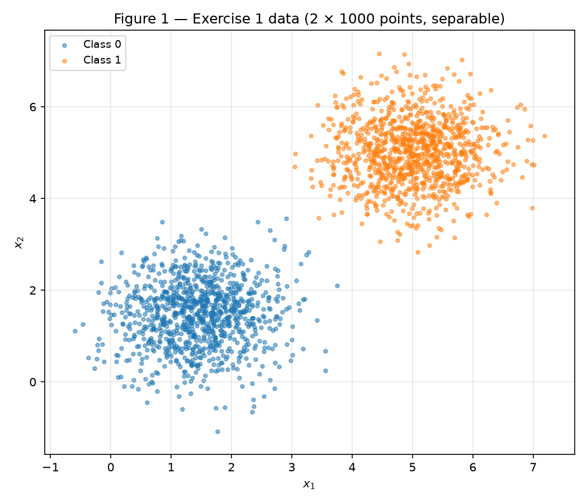
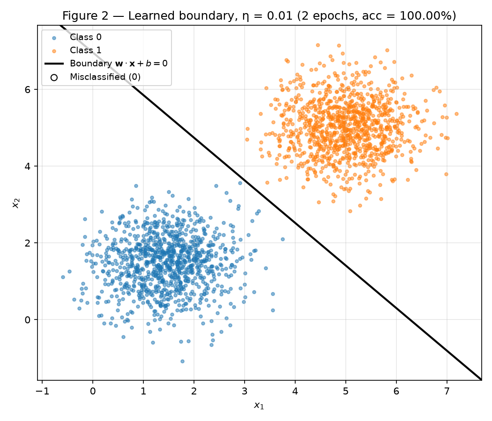
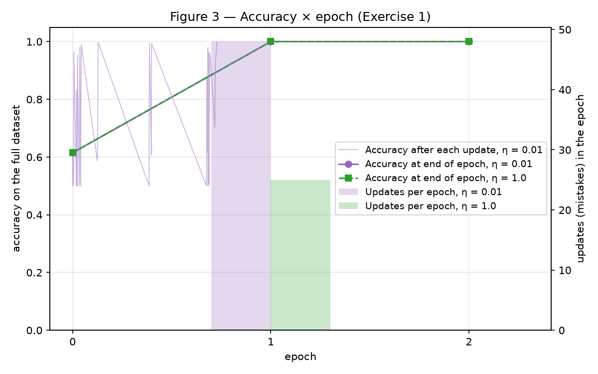
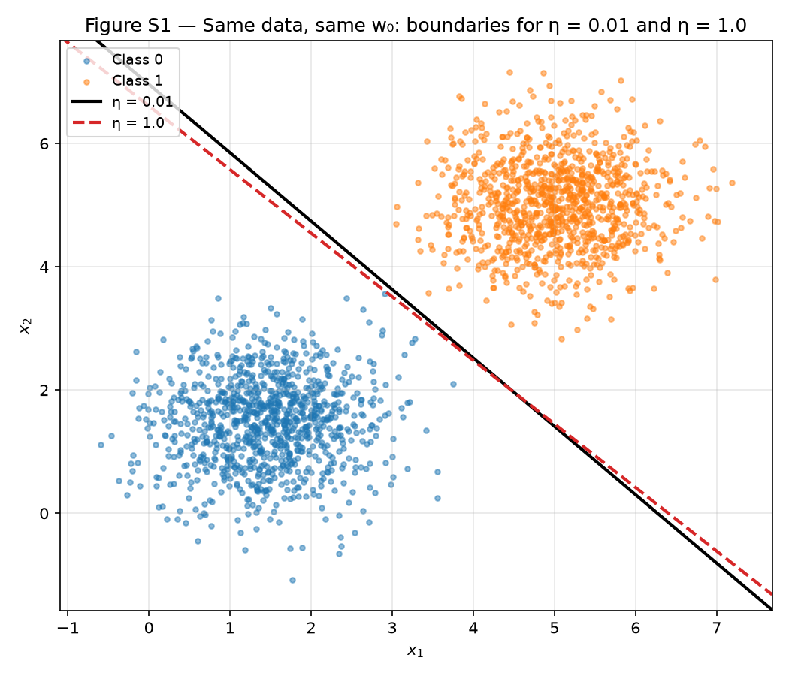
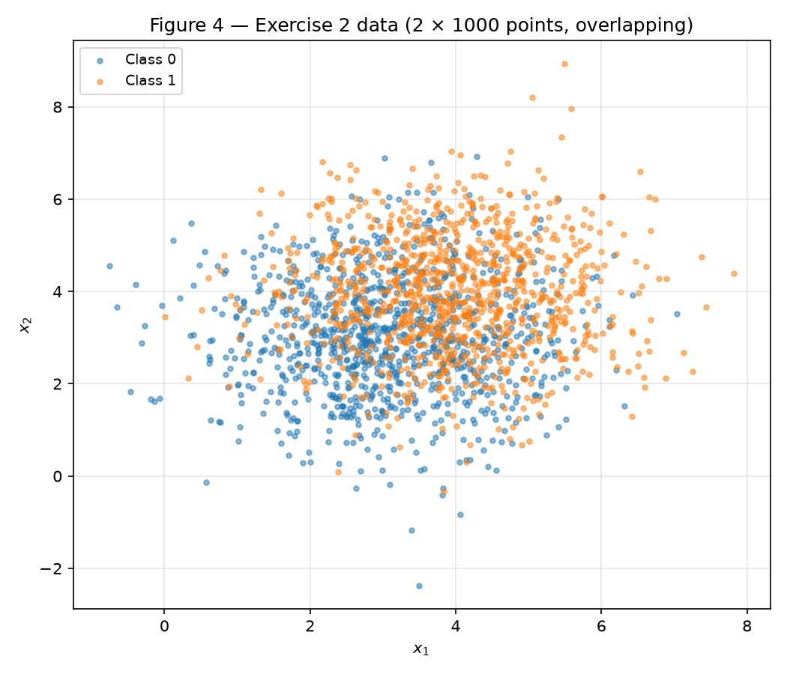
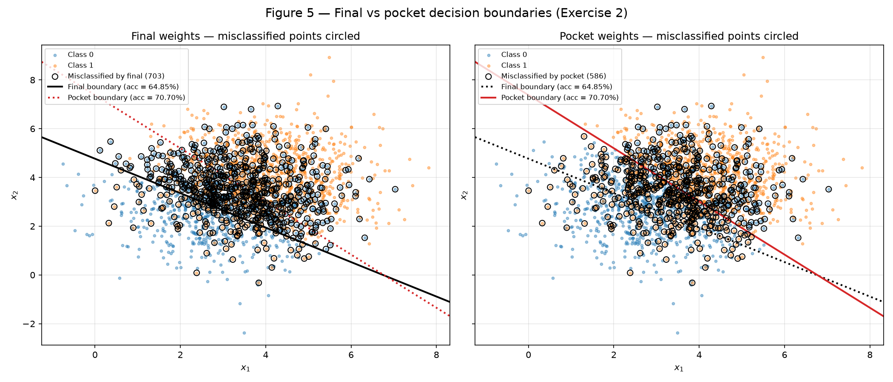
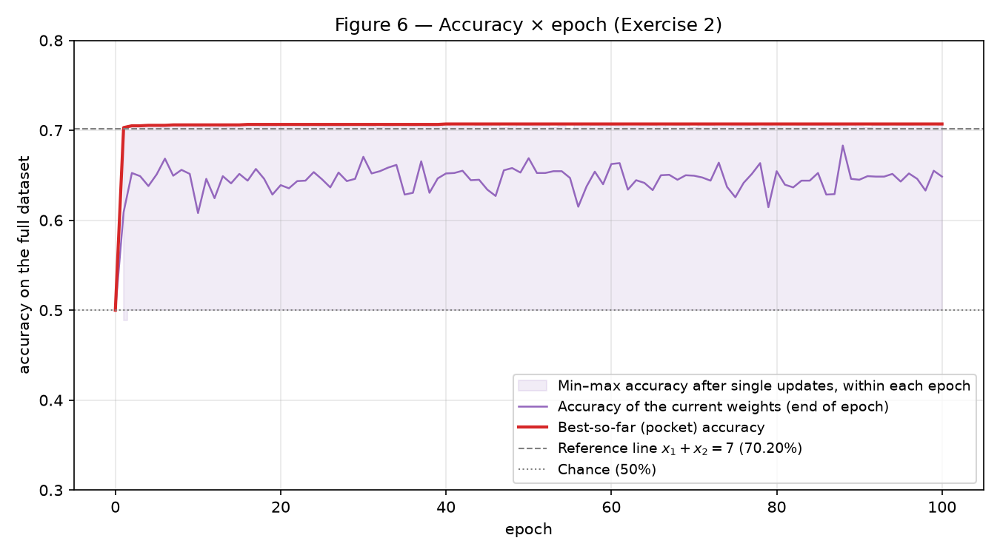
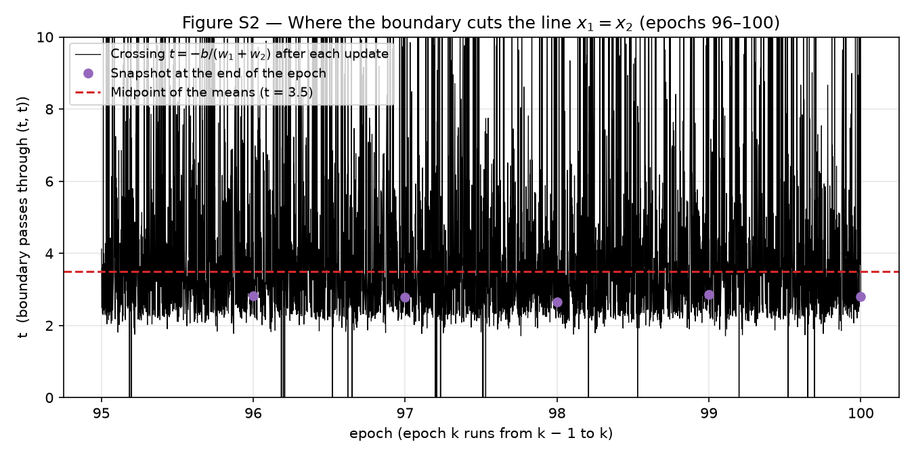

# 2. Perceptron

**Approach.** One script, `code/main.py`, creates the single generator
`rng = np.random.default_rng(42)` and passes it, in order, to the two exercise
modules (`ex1_separable.py`, `ex2_overlapping.py`). The perceptron itself lives
in `code/perceptron.py`, a small class written with NumPy only — activation,
prediction, update rule and training loop. The **same class** is used,
unchanged, in both exercises: it always keeps the pocket (best-so-far weights),
which on separable data simply coincides with the final weights. No
scikit-learn anywhere. Re-running `python docs/exercises/perceptron/code/main.py`
from the repository root regenerates every figure and `results.json`, where
every number quoted below comes from.

The random draws happen in this order: Exercise 1 data (class 0, class 1, one
shuffle), Exercise 1 \(\mathbf{w}_0\), Exercise 2 data, Exercise 2
\(\mathbf{w}_0\). The \(\eta = 1.0\) re-run and all supplementary runs reuse the
data and \(\mathbf{w}_0\) already drawn, so they consume nothing from `rng`.

**Challenges.**

- *Sample order.* Stacking class 0 on top of class 1 and training online
  would show the perceptron 1 000 samples of one class followed by 1 000 of
  the other. I shuffle each dataset **once**, at generation, and keep that order
  for every epoch and every run. A fixed order makes runs comparable (the
  \(\eta = 1.0\) re-run sees the very same sequence) and is what makes the
  zero-start argument of 1.D exact.
- *Exercise 2 did not end near 50 %.* My final weights score 64.85 %, not the
  ~50 % the statement predicts. Section 2.D shows why: the final iterate is a
  snapshot of a boundary that sweeps across the cloud, and where it stops
  depends on the sample order. With the same data sorted by class the final
  accuracy is 50.25 %, matching the statement. I report the shuffled run as
  my result.
- *Pocket granularity.* The pocket is checked after **every update** (full
  accuracy recomputed), not only at the end of an epoch, as the statement asks.
  That costs ~77 000 accuracy evaluations in Exercise 2, which NumPy handles in
  about a second.

??? example "Entry point — `code/main.py`"

    ``` python
    --8<-- "docs/exercises/perceptron/code/main.py"
    ```

??? example "Perceptron — `code/perceptron.py`"

    ``` python
    --8<-- "docs/exercises/perceptron/code/perceptron.py"
    ```

??? example "Data generation and plotting helpers — `code/common.py`"

    ``` python
    --8<-- "docs/exercises/perceptron/code/common.py"
    ```

---

## Exercise 1

??? example "Code — `code/ex1_separable.py`"

    ``` python
    --8<-- "docs/exercises/perceptron/code/ex1_separable.py"
    ```

### A — Generate the data

Class 0 is drawn from \(\mathcal{N}([1.5, 1.5], 0.5\,I)\) and class 1 from
\(\mathcal{N}([5, 5], 0.5\,I)\) with `rng.multivariate_normal`, **1 000 samples
each** (2 000 total), then shuffled once. Sample means: class 0
\((1.450, 1.473)\), class 1 \((5.010, 5.013)\).


/// caption
Figure 1 — Exercise 1 data: two well-separated Gaussian clouds.
///

### B — Implement the perceptron

`Perceptron` in `code/perceptron.py`:

- **Prediction:** \(\hat{y} = \text{step}(\mathbf{w}\cdot\mathbf{x} + b)\),
  with `step(z) = 1 if z >= 0 else 0`.
- **Update:** for every sample, in order, \(e = y - \hat{y} \in \{-1, 0, +1\}\);
  if \(e \ne 0\): \(\mathbf{w} \leftarrow \mathbf{w} + \eta\,e\,\mathbf{x}\),
  \(b \leftarrow b + \eta\,e\). Correct predictions do nothing; a false negative
  (\(e = +1\)) pulls \(\mathbf{w}\) toward \(\mathbf{x}\), a false positive
  (\(e = -1\)) pushes it away. This is the rule for 0/1 labels.
- **Initialization:** \(\mathbf{w}_0\) = `rng.normal(0, 0.01, size=2)`
  \(= (0.009914, -0.008270)\), \(\lVert\mathbf{w}_0\rVert = 0.0129\); \(b_0 = 0\).
- **Learning rate:** \(\eta = 0.01\).
- **Stopping:** after an epoch with **zero updates**, or after 100 epochs.
  Accuracy on the full dataset is recorded after every epoch (and, for the
  pocket, after every update).

### C — Train and measure

Results with \(\eta = 0.01\):

- final \(\mathbf{w} = (0.0319, 0.0287)\), final \(b = -0.20\);
- **2 epochs**: epoch 1 made 48 updates (the last one at sample 1 457 of
  2 000), and epoch 2 was a clean pass with 0 updates, which stops training;
- final accuracy **100.00 %** (0 misclassified points).

The boundary \(0.0319\,x_1 + 0.0287\,x_2 - 0.20 = 0\) crosses the diagonal
\(x_1 = x_2\) at \(t = 3.30\), next to the midpoint of the means (3.25).


/// caption
Figure 2 — Learned boundary \(\mathbf{w}\cdot\mathbf{x} + b = 0\) (\(\eta = 0.01\)). No point is misclassified, so none is circled.
///


/// caption
Figure 3 — Accuracy × epoch. Epoch 0 is the random start (61.5 %). The thin line shows the accuracy after each of the 48 updates of epoch 1; bars show updates per epoch.
///

### D — Analysis

**Why separable data converges quickly.** The rule only acts on mistakes.
Every update moves the boundary toward the misclassified point's correct side.
Once some line classifies every point correctly, \(e = 0\) for every sample,
nothing changes, and that line is a fixed point. Here the margin is wide: the
means are \(3.5\sqrt2 \approx 4.95\) apart and each cloud has a standard
deviation of \(0.71\) per axis. A few corrections are enough to put the line in
the empty gap. The number of updates per epoch falls **48 → 0**, and even
inside epoch 1 the mistakes stop at sample 1 457 (Figure 3): after that point
the line already separates everything. The convergence theorem makes this
quantitative. The number of mistakes is at most \((R/\gamma)^2\), where \(R\)
is the largest \(\lVert\mathbf{x}\rVert\) and \(\gamma\) is the margin, so
well-separated clouds mean few mistakes.

**Re-run with \(\eta = 1.0\)** (same data, same order, same \(\mathbf{w}_0\)):

| run | epochs | updates | final accuracy | \(\mathbf{w}\) | \(b\) | \(\mathbf{w}/\lVert\mathbf{w}\rVert\) | crossing of \(x_1=x_2\) |
|---|---|---|---|---|---|---|---|
| \(\eta = 0.01\) | 2 | 48, 0 | 100 % | (0.0319, 0.0287) | −0.20 | (0.7429, 0.6694) | 3.30 |
| \(\eta = 1.0\) | 2 | 25, 0 | 100 % | (1.7173, 1.6646) | −11.0 | (0.7181, 0.6960) | 3.25 |

Both reach 100 % in 2 epochs, but with **different boundaries**: the
directions differ by **2.09°** and the lines cross the diagonal at different
points (Figure S1).

What \(\eta\) controls here is **how much the random start weighs against each
update**. One update adds \(\eta\,\mathbf{x}\), with
\(\lVert\mathbf{x}\rVert \approx 4.65\) on average:

- \(\eta = 0.01\): a step has size \(\approx 0.047\), only ~3.6 × the size of
  \(\mathbf{w}_0\) (0.0129). The random start is still a sizable part of
  \(\mathbf{w}\) after the first updates, so it changes which points are
  misclassified. The sequence of mistakes differs (48 updates).
- \(\eta = 1.0\): a step has size \(\approx 4.65\), ~360 × \(\lVert\mathbf{w}_0\rVert\).
  After the first update the random start is negligible, and the run behaves
  like a zero start. It makes the same 25 updates as the zero-start run below
  and ends at almost the same weights ((1.7173, 1.6646), −11 vs
  (1.7074, 1.6729), −11).

The ratio \(\lVert\mathbf{w}_0\rVert / (\eta\lVert\mathbf{x}\rVert)\) decides the
path. On separable data any path that ends at a separating line gives 100 %,
so the two runs stop at two different lines inside the same gap.


/// caption
Figure S1 (supplementary) — Same data and same \(\mathbf{w}_0\): boundaries learned with \(\eta = 0.01\) and \(\eta = 1.0\).
///

**Why the zero start is forbidden.** Take \(\mathbf{w}_0 = \mathbf{0}\),
\(b_0 = 0\), and run the whole training twice, with \(\eta_1\) and \(\eta_2\),
over the same sample order. Claim: after every step \(k\),

\[
\mathbf{w}^{(2)}_k = c\,\mathbf{w}^{(1)}_k,\qquad b^{(2)}_k = c\,b^{(1)}_k,
\qquad c = \eta_2/\eta_1 > 0 .
\]

*Induction.* It holds at \(k = 0\) (\(\mathbf{0} = c\,\mathbf{0}\)). Suppose it
holds at step \(k\). For the next sample \(\mathbf{x}\), the two runs make the
**same prediction**, because a positive factor does not change the sign:

\[
\mathbf{w}^{(2)}_k\!\cdot\mathbf{x} + b^{(2)}_k = c\,(\mathbf{w}^{(1)}_k\!\cdot\mathbf{x} + b^{(1)}_k)
\;\Rightarrow\; \hat{y}^{(2)} = \hat{y}^{(1)} \;\Rightarrow\; e^{(2)} = e^{(1)} = e .
\]

Then
\(\mathbf{w}^{(2)}_{k+1} = c\,\mathbf{w}^{(1)}_k + \eta_2\,e\,\mathbf{x}
= c\,(\mathbf{w}^{(1)}_k + \eta_1\,e\,\mathbf{x}) = c\,\mathbf{w}^{(1)}_{k+1}\),
and the same holds for \(b\). ∎

So both runs make the **same mistakes at the same samples**, have the same
number of updates per epoch, and stop at the **same epoch**. Their boundaries
\(\{\mathbf{x}:\mathbf{w}\cdot\mathbf{x}+b=0\}\) are **the same line**, because
multiplying the equation by \(c\) does not change its solutions. \(\eta\) only
rescales \((\mathbf{w}, b)\) and has no effect at all. With
\(\mathbf{w}_0 \ne \mathbf{0}\) the induction fails at \(k = 0\)
(\(\mathbf{w}_0 \ne c\,\mathbf{w}_0\)), and that is why the \(\eta\)
comparison above shows anything.

Numerical check (same data, zero start): \(\eta = 0.01\) gives
\(\mathbf{w} = (0.017074, 0.016729)\), \(b = -0.11\), 2 epochs; \(\eta = 1.0\)
gives \(\mathbf{w} = (1.70743, 1.672855)\), \(b = -11.0\), 2 epochs. The ratios
are exactly **100.000000** for \(w_1\), \(w_2\) and \(b\).

---

## Exercise 2

??? example "Code — `code/ex2_overlapping.py`"

    ``` python
    --8<-- "docs/exercises/perceptron/code/ex2_overlapping.py"
    ```

### A — Generate the data

Class 0 from \(\mathcal{N}([3, 3], 1.5\,I)\), class 1 from
\(\mathcal{N}([4, 4], 1.5\,I)\), **1 000 samples each**, shuffled once, with the
same `rng` (continuing after Exercise 1). Sample means: class 0
\((3.072, 3.019)\), class 1 \((3.955, 3.955)\).


/// caption
Figure 4 — Exercise 2 data: the two clouds overlap heavily.
///

### B — Train, keeping the best weights

Same `Perceptron` class, same \(\eta = 0.01\), 100-epoch cap, and a fresh
\(\mathbf{w}_0 = (-0.014556, -0.004621)\), \(b_0 = 0\). The initial weights
classify everything as class 0 (50.0 %). Training never has a clean epoch and
runs all **100 epochs**, with 822 updates in epoch 1, 757 in epoch 100 and 766
on average.

| weights | \(\mathbf{w}\) | \(b\) | accuracy | predicted as class 1 |
|---|---|---|---|---|
| **final** (after epoch 100) | (0.0682, 0.0965) | −0.46 | **64.85 %** | 75.75 % |
| **pocket** (best seen, found in **epoch 40**) | (0.0709, 0.0650) | −0.48 | **70.70 %** | 47.80 % |

For reference, the best line for the true distributions is the bisector
\(x_1 + x_2 = 7\): **71.81 %** in theory
(\(\Phi\big(\tfrac{\lVert\mu_1-\mu_0\rVert/2}{\sigma}\big) = \Phi(0.577)\))
and **70.20 %** on this sample. The pocket reaches that level; it is even
slightly above it on the training sample, because it was selected on these
very points.

### C — Figures


/// caption
Figure 5 — Both boundaries over the data. Left: points misclassified by the final weights (703) are circled. Right: points misclassified by the pocket weights (586). The panel's own boundary is solid; the other is dotted.
///


/// caption
Figure 6 — Accuracy of the current weights at the end of each epoch (purple) and best-so-far pocket accuracy (red). The shaded band is the range of accuracies reached right after single updates inside each epoch.
///

### D — Analysis

**The gap between final (64.85 %) and pocket (70.70 %).** The final boundary
crosses the diagonal at \(t = 2.79\), about 1 unit (perpendicular distance
0.98) from the data centroid, on the class-0 side. It therefore calls 75.75 %
of the points class 1. The pocket boundary crosses at \(t = 3.53\), essentially
the midpoint 3.5, and splits the points 48/52.

The update rule explains why the loop leaves the line off-center. Along the
diagonal the boundary sits at \(t = -b/(w_1 + w_2)\), so its position is a
**ratio** of \(b\) and \(\mathbf{w}\), and the two move at very different speeds:

- per mistake \(b\) moves by \(\eta = 0.01\), about **2 %** of \(|b| \approx 0.45\);
- per mistake \(\mathbf{w}\) moves by \(\eta\lVert\mathbf{x}\rVert \approx 0.01 \times 5.1 = 0.051\),
  about **54 %** of \(\lVert\mathbf{w}\rVert \approx 0.12\).

The line therefore moves almost only through \(\mathbf{w}\). A false negative
on a class-1 point near \((4, 4)\) adds \(\approx 0.08\) to \(w_1 + w_2\), which is
only ≈ 0.13 when the line is centered (\(b \approx -0.45\), \(t = 3.5\)). So
\(t\) drops from 3.5 to ~2.1 in one step. A false positive near \((3, 3)\)
removes \(\approx 0.06\) and throws \(t\) to ~6.7. \(b\) is much too slow to
compensate. Because no line is error-free, ~38 % of the samples (766 / 2 000)
trigger such a jump **every epoch**. The boundary never settles; it sweeps
back and forth across the overlap region. Over epochs 51–100 its crossing
after each update has median 3.47 (centered on average) but an interquartile
range of 2.56 to 4.80, and inside the last epoch the accuracy after single
updates ranges from 50.0 % to 70.65 % (Figure S2, shaded band of Figure 6).
\(\lVert\mathbf{w}\rVert\) never grows enough to dampen the jumps: it stays
between 0.108 and 0.132 at every epoch end, because opposite mistakes cancel
each other.

The **final weights** are just where the last mistake of epoch 100 threw
the line. With the fixed sample order the end of each epoch always lands at
the same phase of this sweep, which is why the epoch-end snapshots sit
consistently at \(t \in [2.50, 3.01]\) and score 61–68 %. The **pocket** is not
a state the loop settles in. It is the luckiest instant of the sweep, copied
out, and the loop moves away from it on the next mistake.

About the "~50 %" in the statement: that is what the final weights score when
the samples are **sorted by class** (all class 0, then all class 1). The
epoch then ends with 1 000 class-1 samples, whose mistakes are all false
negatives, and each one drags \(t\) down. In that run the final boundary ends
at \(t \approx 0.72\), below the whole cloud, calling almost everything class 1:
**50.25 %** final accuracy (pocket 69.25 %). The mechanism is the same; only
the phase at which the snapshot is taken changes.


/// caption
Figure S2 (supplementary) — Where the boundary crosses \(x_1 = x_2\) after every update during the last 5 epochs, and the end-of-epoch snapshots. The line jumps across the whole cloud from one mistake to the next.
///

**Figure 3 vs Figure 6: what the convergence theorem guarantees.** In
Figure 3 the accuracy climbs to 100 % and then stays there, because there are
no more mistakes and so no more updates. In Figure 6 the end-of-epoch accuracy
keeps oscillating between 60.8 % and 68.3 % for all 100 epochs, and only the
pocket curve is monotone (by construction). The **perceptron convergence
theorem** (Novikoff) says: *if* there are \(\mathbf{w}^*, b^*\) and a margin
\(\gamma > 0\) with \(y'_i(\mathbf{w}^*\cdot\mathbf{x}_i + b^*) \ge \gamma\) for
every sample (labels \(y' = \pm1\)), and \(\lVert\mathbf{x}_i\rVert \le R\), then
the perceptron makes at most \((R/\gamma)^2\) mistakes (up to a constant for
a nonzero start) and stops at a separating line after finitely many epochs.
The assumption this dataset breaks is **linear separability** (existence of a
\(\gamma > 0\)). Even the best line misclassifies ~29 % of the points, so no
such margin exists. The theorem then promises nothing, neither convergence nor
proximity to the best line. The only thing that still holds is that the
weights stay bounded (the perceptron cycling theorem), and that matches what
we see: bounded, never settling.

**More epochs? Smaller \(\eta\)? Neither fixes it.**

- *More epochs.* The loop stops only after an epoch with zero mistakes, and
  every line makes at least ~580 mistakes here (the best one scores ~71 %).
  So every future epoch still contains hundreds of updates, each one a jump of
  about half of \(\lVert\mathbf{w}\rVert\) (above). The process is stationary:
  nothing in the rule shrinks the steps or accumulates progress, so epoch 1 000
  looks statistically like epoch 100. The final iterate stays a random
  snapshot of the sweep, and more epochs only give the pocket more chances.
  Sanity check (not the justification): with 500 epochs, the last 100
  end-of-epoch accuracies average 64.66 % (range 54.5–68.3 %), and the pocket
  improves only marginally, to 70.75 %.
- *Smaller \(\eta\).* The algebra of Exercise 1.D applies. Once the updates
  dominate \(\mathbf{w}_0\) (after a handful of mistakes here), the whole
  trajectory is \(\mathbf{w}_k \approx \eta\sum \pm\mathbf{x}\),
  \(b_k \approx \eta\sum \pm 1\). Changing \(\eta\) rescales \((\mathbf{w}, b)\)
  and each step by the same factor. The **relative** step
  \(\eta\lVert\mathbf{x}\rVert / \lVert\mathbf{w}\rVert\), which is what moves
  the line, and the position \(t = -b/(w_1+w_2)\) are unchanged. A smaller
  \(\eta\) produces the same sweep in smaller units. Sanity check:
  \(\eta = 0.001\) gives a last-100-epoch mean of 64.50 % (vs 64.6 % with
  \(\eta = 0.01\)). Its final value happens to be 68.25 %, just another
  snapshot.

What actually helps is not changing these two knobs but changing what is
returned or optimized: keeping the pocket (as here), averaging the weights
over the updates, or minimizing a smooth loss (e.g. logistic regression),
whose gradient steps shrink as the fit improves.

---

## Results summary

| # | Quantity | Value |
|---|---|---|
| 1 | Exercise 1 — final \(\mathbf{w}\) and \(b\) | \(\mathbf{w} = (0.0319, 0.0287)\), \(b = -0.20\) |
| 2 | Exercise 1 — epochs to convergence | **2** (48 updates in epoch 1, 0 in epoch 2) |
| 3 | Exercise 1 — final accuracy | **100.00 %** |
| 4 | Exercise 1 — epochs and final accuracy with \(\eta = 1.0\) | **2** epochs (25 updates, then 0), **100.00 %**; \(\mathbf{w} = (1.7173, 1.6646)\), \(b = -11.0\), direction 2.09° from the \(\eta = 0.01\) run |
| 5 | Exercise 2 — final \(\mathbf{w}\) and \(b\) | \(\mathbf{w} = (0.0682, 0.0965)\), \(b = -0.46\) (pocket: \((0.0709, 0.0650)\), \(-0.48\)) |
| 6 | Exercise 2 — accuracy of the final weights | **64.85 %** |
| 7 | Exercise 2 — accuracy of the pocket weights | **70.70 %** |
| 8 | Exercise 2 — epoch at which the pocket best occurred | **epoch 40** |
